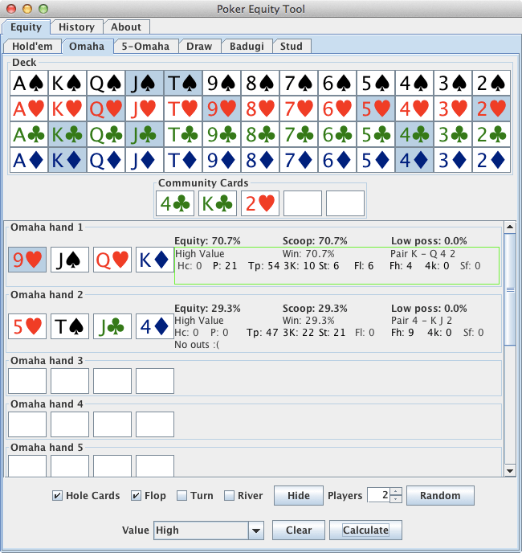
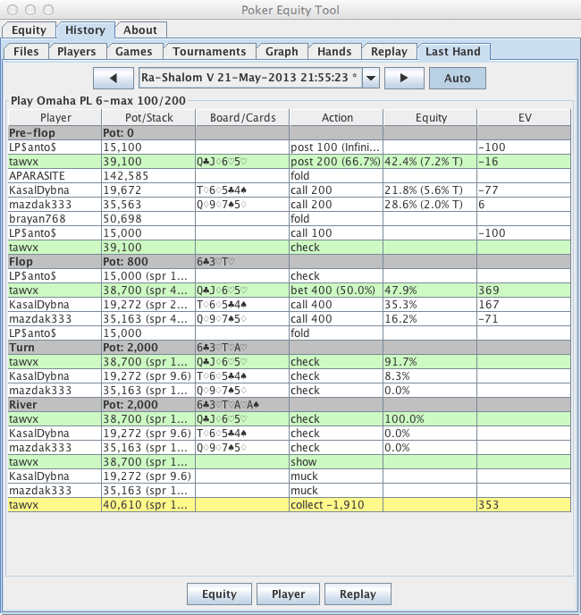
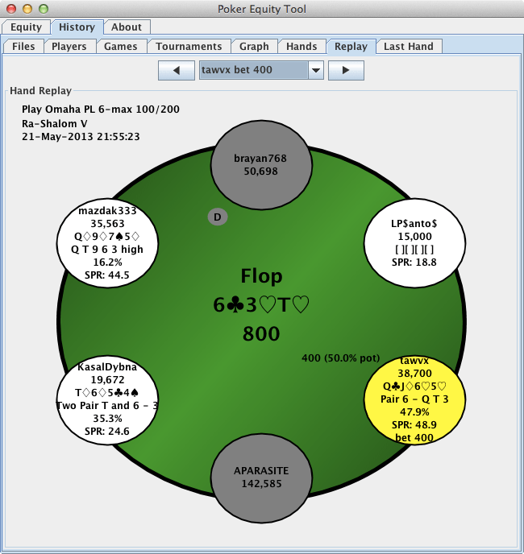

# PET - Poker Equity Tool

PET includes

- A poker equity calculator for 
  - Hold'em, Omaha, Omaha H/L - estimated pre-flop, and exact post 
    flop
  - 5 Card Draw, 2-7 Triple Draw (estimated)
  - Stud, Razz, 5 Card Stud (estimated)
  - Badugi (estimated)

- A fast PokerStars and Full Tilt hand parser, with
   - searchable/sortable lists of players, games, tournaments and hands
   - Two hand replayers, both including hand equity and SPR (stack to 
     pot ratio)
   - a floating HUD for tables currently being played at

PET does not modify, move or copy parsed hand history files, or share 
them with others (as doing so would be against the PokerStars TOS).

## Screenshots

The Omaha equity calculator (could use simplifying a bit)

The hand parser last hand table

The hand parser replayer

## Download

No binary download provided
